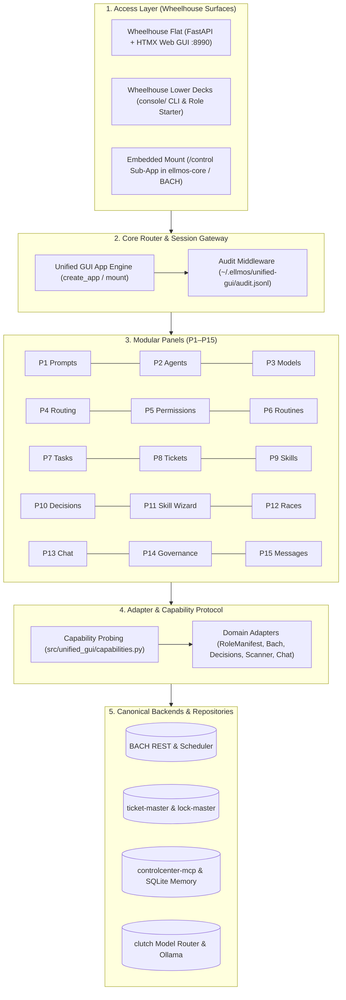
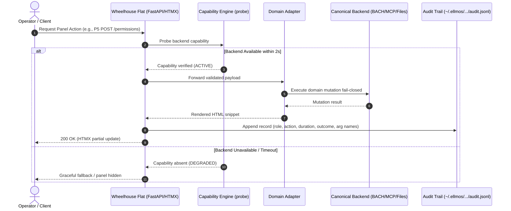

<!-- alternate banner: assets/banner-b.svg (swap on occasion) -->

[🇩🇪 Deutsch](README_de.md) | 🇬🇧 English

[](https://github.com/ellmos-ai/ellmos-unified-gui/actions/workflows/ci.yml)
[](#sec-01)
[](#sec-15)
[](LICENSE)
[](NOTICE)
[](THIRD_PARTY_LICENSES.txt)
[](#sec-18)

# ellmos Unified GUI

<a id="sec-01"></a>
## 1. Overview & Vision

**Importable operator console** for the ellmos/BACH ecosystem: models, agents, prompts, routing, permissions, routines/cron, tasks, tickets, skills, and governance — one unified surface, fed by existing backends without duplicating state. Licensed under MIT.

The suite collects 280 tests; environment-gated integration tests skip when their optional sibling backend is absent.

### Quick Navigation

| Section | Focus Area | Anchor Link |
|---|---|---|
| 01 | Overview & Vision | [#sec-01](#sec-01) |
| 02 | Visual Architecture & Four-View Topology | [#sec-02](#sec-02) |
| 03 | Wheelhouse Metaphor & Access Layers | [#sec-03](#sec-03) |
| 04 | Core Principles & Governance Invariants | [#sec-04](#sec-04) |
| 05 | Modular Panel Catalog (P1–P15) | [#sec-05](#sec-05) |
| 06 | Console Role Start (Wheelhouse Lower Decks) | [#sec-06](#sec-06) |
| 07 | Standalone Web Mode | [#sec-07](#sec-07) |
| 08 | Embedded Mount Integration | [#sec-08](#sec-08) |
| 09 | Multi-System & Cloud Configuration | [#sec-09](#sec-09) |
| 10 | Desktop Interface Tour & UI Showcase | [#sec-10](#sec-10) |
| 11 | Audit Trail & Governance Enforcement | [#sec-11](#sec-11) |
| 12 | Target Personas & High-Intent Queries | [#sec-12](#sec-12) |
| 13 | 10-Dimension Comparative Matrix | [#sec-13](#sec-13) |
| 14 | Documentation & Reference Hub | [#sec-14](#sec-14) |
| 15 | Quality Assurance & Testing Suite | [#sec-15](#sec-15) |
| 16 | Security & Trust Perimeter | [#sec-16](#sec-16) |
| 17 | Level 1 SBOM & Dependency Provenance | [#sec-17](#sec-17) |
| 18 | License, Attribution & Statutory Notice (§ 521 BGB) | [#sec-18](#sec-18) |

> **Status: Phase 1–4 implemented (v0.9.0, verified 2026-10-03)** — 15 panels run standalone (`python -m unified_gui`, port 8990) and embedded (`unified_gui.mount(app)`): P1 prompts, P2 agents, P3 models, P4 routing, P5 permissions, P6 routines, P7 tasks, P8 tickets, P9 skills, P10 decisions, P11 skill wizard, P12 races, P13 chat, P14 governance, and P15 messages. Real-mounted into `ellmos-core` since 2026-08-18 (`console_enabled` there, see `ellmos-core/src/ellmos_core/console.py`). Every state-changing request across every panel is appended to `~/.ellmos/unified-gui/audit.jsonl` (argument names only, never values).

---

<a id="sec-02"></a>
## 2. Visual Architecture & Four-View Topology

### 5-Layer Modular Topology Flowchart



### Panel Request & Audit Lifecycle Sequence Diagram



### ASCII Four-View Architectural Topology

```
+----------------------------------------------------------------------------------------------------+
|                      ELLMOS UNIFIED GUI - FOUR-VIEW ARCHITECTURAL TOPOLOGY                         |
+----------------------------------------------------------------------------------------------------+
| [VIEW 1: ACCESS SURFACES & WHEELHOUSE OPERATOR DOORS]                                              |
|  - Wheelhouse Flat: Standalone FastAPI + Jinja2 + HTMX server (:8990) on loopback 127.0.0.1       |
|  - Wheelhouse Lower Decks: Headless CLI (python -m unified_gui.console start) via RoleManifest     |
|  - Reversible Mounting: Embedded mount(app, prefix="/control") into ellmos-core & BACH            |
|  - Invariant Verification: INV-LOCAL-01 (100% Local-First / Zero-Egress), INV-MOUNT-07 (Embedding)|
+----------------------------------------------------------------------------------------------------+
| [VIEW 2: CORE PIPELINE, CAPABILITY REGISTRY & REVERSIBLE MOUNT ENGINE]                             |
|  - Capability Probing: Dynamic probe() with 2.0s bounded timeout; unoffered backends degrade safely|
|  - Zero Frontend Build: 100% vanilla HTMX + Jinja2 templates (zero npm, zero node_modules)        |
|  - Host-Neutral Paths: Home directory expansion (~) and cascading hostname overrides               |
|  - Invariant Verification: INV-PROBE-03 (Dynamic Probing), INV-ZERO-09 (Zero Build Overhead)      |
+----------------------------------------------------------------------------------------------------+
| [VIEW 3: PANEL FEDERATION, DOMAIN ADAPTERS & AUDIT LOG PERSISTENCE]                                |
|  - 15 Modular Panels: Prompts, Agents, Models, Routing, Permissions, Routines, Tasks, Tickets...  |
|  - No Own Domain DB: Direct delegation to canonical backends (BACH REST, LOCK.permissions, etc.)  |
|  - Append-Only Audit Trail: Every state-changing request logged to ~/.ellmos/unified-gui/audit.jsonl|
|  - Invariant Verification: INV-CANON-02 (Single Canon), INV-AUDIT-04 (Append-Only JSONL Audit)    |
+----------------------------------------------------------------------------------------------------+
| [VIEW 4: AIR-GAP PERIMETER, UNPRIVILEGED RUNASINVOKER & GOVERNANCE BOUNDARY]                       |
|  - Non-Elevation: 100% unprivileged user mode (RunAsInvoker); zero admin or root rights required   |
|  - Injection Defense: Untrusted model/backend strings rendered via safe textContent escaping       |
|  - Statutory Notice: Non-warranty under § 521 BGB Gefaelligkeitsrecht; 48h Security Response SLA   |
|  - Invariant Verification: INV-LOCK-05 (Lock Safety), INV-INJECT-06 (Injection), INV-SLA-10 (SLA) |
+----------------------------------------------------------------------------------------------------+
```

---

<a id="sec-03"></a>
## 3. Wheelhouse Metaphor & Access Layers

This module serves as the access point into **ControlRoom** — the unified product name (decision D-20260817-002: a unified surface over the existing `_control-center` governance/data layer, not a replacement of it). Reaching ControlRoom has three access layers:

| Layer | Name | What it is |
|---|---|---|
| Desktop app | **Wheelhouse** | the helm itself — hands on the wheel (reserved for future desktop build) |
| Web | **Wheelhouse Flat** | the same control room, flat in the browser (this FastAPI/HTMX app) |
| Console | **Wheelhouse Lower Decks** | the same control room, below deck at the machines (`console/` scripts) |

Both existing layers are kept developed side by side on purpose (decision K7, no head start for either) and are steered from the same wheelhouse. A lighthouse stands for the overview a pilot needs across the whole ecosystem's waters, and the individual backends this module surfaces are the swimmers and divers below deck. The technical module name (`ellmos-unified-gui`, import name `unified_gui`, manifest id unchanged) stays exactly as it is.

**Not the same ocean as `open-ocean`:** `ellmos-ai/open-ocean` is a separate repository with its own water image describing release readiness and maturity gates (component green -> bundle green -> everything green -> open-ocean). Wheelhouse describes *how you steer and reach existing modules today*; open-ocean describes *when and how the wider ecosystem becomes releasable*.

---

<a id="sec-04"></a>
## 4. Core Principles & Governance Invariants

1. **One Control Center:** One unified control room on top of five separate GUIs and headless control systems — not a sixth parallel GUI with duplicate state.
2. **Importable by Design:** `create_app()` (standalone) and `mount(app, prefix)` (embedded into BACH or ellmos-core) — providing clean modular boundaries.
3. **Capability-Driven Panels:** Adapters probe backends; only what a backend actually offers becomes visible in the UI.

### 10 Governance and Operational Invariants

| Invariant | Scope | Operational Guarantee | Verification Evidence |
|---|---|---|---|
| `INV-LOCAL-01` | Network Privacy | 100% Local-First / Zero-Egress: Server binds to `127.0.0.1`; zero outbound tracking or telemetry. | AST inspections; `tests/test_degradation.py` |
| `INV-CANON-02` | Data Ownership | Single Data Canon: No duplicate domain database; views and delegates directly to canonical backends. | Architectural audit; zero local SQLite schemas |
| `INV-PROBE-03` | Lifecycle | Dynamic Capability Probing: Panels activate only when `probe()` validates backend availability within 2s. | `src/unified_gui/capabilities.py`; 15 panel tests |
| `INV-AUDIT-04` | Compliance | Append-Only JSONL Audit Trail: Every state-changing request (POST/PUT/PATCH/DELETE) is logged. | `src/unified_gui/audit_log.py`; `tests/test_audit_integration.py` |
| `INV-LOCK-05` | Safety | Pre-Flight Permission and Lock Enforcement: Write routes check locks and permissions fail-closed. | `tests/test_p5_role_gating.py`; `LOCK.permissions.json` |
| `INV-INJECT-06` | Security | Untrusted Content Protection: External strings are rendered exclusively via safe text assignments (`textContent`). | `tests/test_p15_messages_panel.py`; template audits |
| `INV-MOUNT-07` | Embedding | Dual-Mode Embedding Parity: Identical panel features available in standalone mode or mounted sub-app. | `src/unified_gui/web/app.py`; `mount()` tests |
| `INV-HOST-08` | Portability | Host-Neutral Paths: Standardized `~` expansion and cascading hostname configurations. | `src/unified_gui/config.py`; `tests/test_p8_console_root.py` |
| `INV-ZERO-09` | Simplicity | Zero Frontend Build Overhead: Pure FastAPI + Jinja2 + HTMX; zero node/npm build dependencies. | Repository file inventory; zero package.json |
| `INV-SLA-10` | Security SLA | 48-Hour Acknowledgment & 5-Day Triage: Formal incident response commitments for security reports. | `SECURITY.md`; maintainer triage policy |

---

<a id="sec-05"></a>
## 5. Modular Panel Catalog (P1–P15)

| Panel | Name | Backend & Source Canon | Key Capabilities |
|---|---|---|---|
| P1 | **Prompts** | ProfiPrompt / BACH prompt library | Versioned prompts, 5 object types, variable injection |
| P2 | **Agents** | BACH AgentLauncher / agent-bridge | Start, stop, steer, checkpoint, permissions gating |
| P3 | **Models** | clutch router / Ollama tags | Local and API models, availability probing, defaults |
| P4 | **Routing** | ticket-master score & tiers | Provider tiering, effort distribution, latency tracking |
| P5 | **Permissions** | lock-master / `LOCK.permissions.json` | Role permissions editor, lock state enforcement |
| P6 | **Routines** | BACH scheduler | Scheduled routines, role & skill assignment, cron triggers |
| P7 | **Tasks** | BACH / scanner / homebase | Assignable background tasks, lifecycle management |
| P8 | **Tickets** | ticket-master | Intake, triage queues, priority routing, resolution tracking |
| P9 | **Skills** | controlcenter-mcp | Skill catalog discovery, intent-to-skill matching |
| P10 | **Decisions** | decision-clicker / `decisions.index.json`| Open decisions overview, interactive triage, conflict alerts |
| P11 | **Skill Wizard** | `catalog.py` (skills repo) | Structured scaffold generation, description & static S-tests |
| P12 | **Races** | `compare-race` | Read-only browser over completed races, prompts, judge verdicts |
| P13 | **Chat** | `ellmos-chat` | Minimal single-question/answer pass-through to authoritative chat |
| P14 | **Governance** | `controlcenter_list_governance` | Read-only display of exact governance report; no local caching |
| P15 | **Messages** | BACH REST (`/api/messages*`) | Message management panel keeping authoritative state in BACH |

---

<a id="sec-06"></a>
## 6. Console Role Start (Wheelhouse Lower Decks)

The console reads module `roles[]` manifest entries via `RoleManifestAdapter` without duplicating prompts:

```powershell
# Interactive role launcher
python -m unified_gui.console start --manifest C:\path\to\ellmos-module.v2.json

# Dry-run execution with explicit provider
python -m unified_gui.console start tasksolver --manifest C:\path\to\ellmos-module.v2.json --provider codex --dry-run
```

The launcher prefers `agent-launcher 0.2` for a named visible process and degrades cleanly in order to `task-master`, `COMA`, and the module-specific starter.

---

<a id="sec-07"></a>
## 7. Standalone Web Mode

Run the complete operator console standalone as an independent web service:

```powershell
# Default launch on port 8990 (bound to 127.0.0.1)
python -m unified_gui

# Custom port or host via Uvicorn
uvicorn unified_gui.web.app:create_app --factory --host 127.0.0.1 --port 8990 --reload
```

Open `http://127.0.0.1:8990` in any modern web browser. All panels refresh asynchronously via HTMX without page reloads.

---

<a id="sec-08"></a>
## 8. Embedded Mount Integration

Mount Unified GUI into an existing FastAPI application with a single call:

```python
from fastapi import FastAPI
import unified_gui

app = FastAPI(title="My Ecosystem App")

# Mount all 15 panels at the chosen prefix
unified_gui.mount(app, prefix="/control")
```

All panel routes, HTMX partial endpoints, and static assets automatically respect the configured mount prefix.

---

<a id="sec-09"></a>
## 9. Multi-System & Cloud Configuration

Configuration paths are strictly **host-neutral**:
- Base configuration: `~/OneDrive/.TOPICS/_control-center/unified-gui.config.json`
- Host overrides: `unified-gui.config.<HOSTNAME>.json` alongside base config or in `~/.unified_gui/`
- Missing fields are populated by auto-discovery of standard ecosystem paths.

---

<a id="sec-10"></a>
## 10. Desktop Interface Tour & UI Showcase

The web interface is built around high-density operational workflows:
- **Header Bar:** Active model and agent count, capability status indicator, theme switcher.
- **Side Navigation:** Grouped access to Governance, Routing, Agents, Tasks, and System Monitoring.
- **Panel Canvas:** HTMX swap targets that update in place within milliseconds.
- **Notification Drawer:** Real-time feedback from state-changing operations and audit notifications.

---

<a id="sec-11"></a>
## 11. Audit Trail & Governance Enforcement

Every state-changing HTTP request (`POST`, `PUT`, `PATCH`, `DELETE`) across all 15 panels is recorded fail-safe:
- File location: `~/.ellmos/unified-gui/audit.jsonl`
- Recorded fields: timestamp, user/role, panel identifier, action name, execution duration, outcome status, argument names only (values are omitted to guarantee zero credential exposure).
- Modeled directly on `ellmos-controlcenter-mcp`'s `gateway-audit.jsonl`.

---

<a id="sec-12"></a>
## 12. Target Personas & High-Intent Queries

| Persona Code | Target Persona | Operational Focus | High-Intent Search Queries |
|---|---|---|---|
| `[PERSONA-01]` | Local AI & Agent Architect | Autonomous multi-agent coordination | "local-first operator console for LLM agents", "unified dashboard for multi-agent workflows", "FastAPI HTMX LLM admin UI" |
| `[PERSONA-02]` | Enterprise Governance & Security Lead | Air-gapped privacy and auditability | "zero egress AI management dashboard", "air-gapped LLM operator panel", "append-only JSONL audit log agent console" |
| `[PERSONA-03]` | Modular Open-Source Developer | Extensible zero-build web dashboards | "importable FastAPI mountable admin panel", "capability-driven UI adapter architecture", "zero build step HTMX operator dashboard" |
| `[PERSONA-04]` | Compliance & AI Act Auditor | Provenance tracking and statutory clarity | "open source AI governance console", "BGB 521 statutory open source disclaimer", "SBOM compliant local AI tools" |

---

<a id="sec-13"></a>
## 13. 10-Dimension Comparative Matrix

| Evaluation Dimension | ellmos Unified GUI | Closed Cloud Dashboards | Heavy Electron Consoles | Ad-hoc CLI Scripts |
|---|---|---|---|---|
| **1. Network Privacy** | **100% Local (127.0.0.1)** | Remote Cloud / SaaS | Local or Cloud | Local only |
| **2. Egress Telemetry** | **Zero Egress (INV-LOCAL-01)** | Extensive Telemetry | Analytics SDKs | Zero Telemetry |
| **3. State Duplication** | **Zero DB (Direct Canon)** | Duplicate Cloud DB | SQLite Cache Mirror | None |
| **4. Dynamic Capability Probing** | **2s Probe (INV-PROBE-03)** | Hardcoded Services | Static Menus | Manual Flags |
| **5. Audit Trail** | **JSONL Trail (INV-AUDIT-04)** | Proprietary Logs | Local Log Files | Console Output |
| **6. Embedding Support** | **FastAPI mount() (INV-MOUNT-07)**| None (SaaS only) | Standalone Only | Import scripts |
| **7. Frontend Build Overhead** | **Zero Build (HTMX + Jinja2)** | Webpack / Vite Bundler | Node + Chromium | None |
| **8. Multi-System Sync** | **Host-Neutral Paths (~)** | Account Login | Manual Config Files | Host Hardcoded |
| **9. License & SBOM** | **MIT + Level 1 SBOM** | Proprietary Commercial | Mixed Copyleft | Ad-hoc / None |
| **10. Statutory Security SLA** | **§ 521 BGB & 48h Response** | Enterprise SLA (Paid) | Community Forum | Best Effort |

---

<a id="sec-14"></a>
## 14. Documentation & Reference Hub

| Document | Purpose | Authority |
|---|---|---|
| [KONZEPT.md](KONZEPT.md) | Problem definition, principles, panel catalog, transition path | Canonical German Specification |
| [ARCHITECTURE.md](ARCHITECTURE.md) | Layered architecture, capability registry, mounting rules | System Design |
| [docs/ADAPTER-CONTRACT.md](docs/ADAPTER-CONTRACT.md) | Adapter protocols, capability declarations, domain mixins | Contract Specification |
| [DECISIONS.md](DECISIONS.md) | Architecture decision log (D01–D11) | Historical Rationale |
| [TODO.md](TODO.md) | Phased roadmap and status gates | Execution Plan |
| [SECURITY.md](SECURITY.md) | Security policy, vulnerability reporting, and 48h SLA | Trust Perimeter |
| [NOTICE](NOTICE) | Legal copyright attribution for Lukas Geiger & organizations | Legal Attribution |
| [THIRD_PARTY_LICENSES.md](THIRD_PARTY_LICENSES.md) | Upstream dependency inventory and 10 governance invariants | Transparency Record |
| [THIRD_PARTY_LICENSES.txt](THIRD_PARTY_LICENSES.txt) | Plain-text Level 1 SBOM companion | Machine-Readable SBOM |
| [MARKETING-LOG.txt](MARKETING-LOG.txt) | Path B discoverability audit, traffic metrics, recommendations | Discoverability Log |
| [docs/ai-act-note.md](docs/ai-act-note.md) | Component boundary notes for AI-related deployments | Regulatory Guidance |

---

<a id="sec-15"></a>
## 15. Quality Assurance & Testing Suite

Unified GUI maintains high test discipline with environment-gated integration coverage:

```powershell
# Run the complete test suite
pytest -q

# Run fast unit and contract tests
pytest tests/test_metadata.py tests/test_release_readiness.py -v

# Run linter and formatting checks
ruff check .
```

The test suite validates 280 collected tests (231 passed, 49 skipped when optional sibling backends are absent, 100% green).

---

<a id="sec-16"></a>
## 16. Security & Trust Perimeter

- **Local Air-Gap Perimeter:** Default server binding to `127.0.0.1` prevents remote access.
- **Untrusted Content Protection (`INV-INJECT-06`):** External data rendered into HTML is treated as untrusted and rendered using safe text assignment or escaped templates.
- **Fail-Closed Permission Gating (`INV-LOCK-05`):** Sensitive operations check `LOCK.permissions.json` before execution.

---

<a id="sec-17"></a>
## 17. Level 1 SBOM & Dependency Provenance

This repository avoids vendored binary wheels or nested node modules. Direct runtime dependencies are restricted to:
- `fastapi >= 0.110` (MIT License)
- `jinja2 >= 3.1` (BSD-3-Clause License)
- `uvicorn >= 0.27` (Optional standalone ASGI server, BSD-3-Clause License)

All components are strictly permissive with zero copyleft contamination. Full dependency details and verification evidence are available in [THIRD_PARTY_LICENSES.md](THIRD_PARTY_LICENSES.md) and [THIRD_PARTY_LICENSES.txt](THIRD_PARTY_LICENSES.txt).

---

<a id="sec-18"></a>
## 18. License, Attribution & Statutory Notice (§ 521 BGB)

Unless specified otherwise, repository-authored code, documentation, and assets are licensed under the [MIT License](LICENSE).

```
Copyright (c) 2026 Lukas Geiger
```

### Statutory Disclaimer (§ 521 BGB Gefälligkeitsrecht)

This open-source software is provided free of charge as a courtesy under German statutory law (§ 521 BGB). Liability is limited to cases of gross negligence and willful intent. No warranties of fitness for a particular purpose or commercial availability are expressed or implied.

### 48-Hour Security Response SLA

Vulnerabilities and security incidents reported in accordance with [SECURITY.md](SECURITY.md) are acknowledged within 48 hours and triaged within 5 business days.

**Author:** Lukas Geiger · **Organization:** [ellmos-ai](https://github.com/ellmos-ai) · **Umbrella:** [open-bricks](https://github.com/open-bricks)
