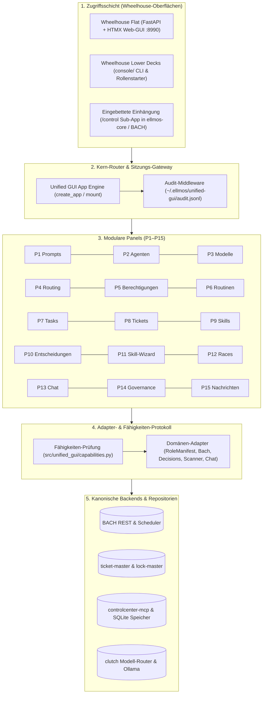
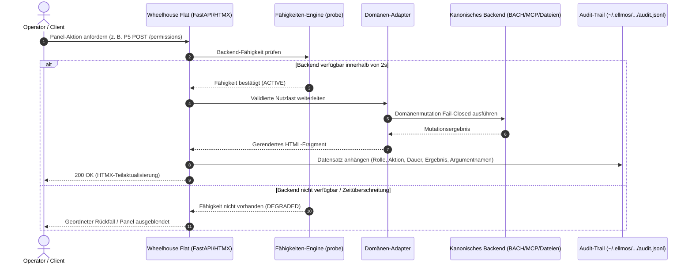

<!-- alternatives Banner: assets/banner-b.svg (bei Bedarf tauschen) -->

🇩🇪 Deutsch | [🇬🇧 English](README.md)

[](https://github.com/ellmos-ai/ellmos-unified-gui/actions/workflows/ci.yml)
[](#sec-01)
[](#sec-15)
[](LICENSE)
[](NOTICE)
[](THIRD_PARTY_LICENSES.txt)
[](#sec-18)

# ellmos Unified GUI

<a id="sec-01"></a>
## 1. Übersicht & Vision

**Importierbare Operator-Konsole** für das ellmos-/BACH-Ökosystem: Modelle, Agenten, Prompts, Routing, Berechtigungen, Routinen/Cron, Tasks, Tickets, Skills und Governance — eine vereinheitlichte Oberfläche, gespeist aus vorhandenen Backends ohne Zustandsduplizierung. MIT-lizenziert.

Die Suite umfasst 280 Tests; umgebungsabhängige Integrationstests werden übersprungen, wenn das optionale benachbarte Backend fehlt.

### Schnellnavigation

| Abschnitt | Schwerpunkt | Ankerlink |
|---|---|---|
| 01 | Übersicht & Vision | [#sec-01](#sec-01) |
| 02 | Visuelle Architektur & Vier-Sichten-Topologie | [#sec-02](#sec-02) |
| 03 | Wheelhouse-Metapher & Zugriffsschichten | [#sec-03](#sec-03) |
| 04 | Kernprinzipien & Governance-Invarianten | [#sec-04](#sec-04) |
| 05 | Modularer Panel-Katalog (P1–P15) | [#sec-05](#sec-05) |
| 06 | Konsolen-Rollenstart (Wheelhouse Lower Decks) | [#sec-06](#sec-06) |
| 07 | Eigenständiger Web-Modus (Standalone) | [#sec-07](#sec-07) |
| 08 | Eingebettete Integration (Mount) | [#sec-08](#sec-08) |
| 09 | Multi-System- & Cloud-Konfiguration | [#sec-09](#sec-09) |
| 10 | Desktop-Oberflächentour & UI-Präsentation | [#sec-10](#sec-10) |
| 11 | Prüfprotokoll & Governance-Durchsetzung (Audit-Trail) | [#sec-11](#sec-11) |
| 12 | Ziel-Personas & Suchanfragen hoher Absicht | [#sec-12](#sec-12) |
| 13 | 10-Dimensionen-Vergleichsmatrix | [#sec-13](#sec-13) |
| 14 | Dokumentations- & Referenzzentrum | [#sec-14](#sec-14) |
| 15 | Qualitätssicherung & Test-Suite | [#sec-15](#sec-15) |
| 16 | Sicherheit & Vertrauensgrenzen | [#sec-16](#sec-16) |
| 17 | Level 1 SBOM & Abhängigkeits-Provenienz | [#sec-17](#sec-17) |
| 18 | Lizenz, Urheberschaft & Gesetzlicher Haftungsausschluss (§ 521 BGB) | [#sec-18](#sec-18) |

> **Status: Phase 1–4 umgesetzt (v0.9.0, verifiziert 2026-10-03)** — 15 Panels laufen eigenständig (`python -m unified_gui`, Port 8990) und eingebettet (`unified_gui.mount(app)`): P1 Prompts, P2 Agenten, P3 Modelle, P4 Routing, P5 Berechtigungen, P6 Routinen, P7 Tasks, P8 Tickets, P9 Skills, P10 Entscheidungen, P11 Skill-Wizard, P12 Races, P13 Chat, P14 Governance und P15 Nachrichten. Seit 2026-08-18 real in `ellmos-core` eingehängt (`console_enabled` dort, siehe `ellmos-core/src/ellmos_core/console.py`). Jede zustandsändernde Anfrage über alle Panels hinweg wird an `~/.ellmos/unified-gui/audit.jsonl` angehängt (ausschließlich Argumentnamen, niemals Werte).

---

<a id="sec-02"></a>
## 2. Visuelle Architektur & Vier-Sichten-Topologie

### 5-Schichten Modulare Topologie (Flussdiagramm)



### Panel-Anfrage & Audit-Lebenszyklus (Sequenzdiagramm)



### ASCII Vier-Sichten Architekturtopologie

```
+----------------------------------------------------------------------------------------------------+
|                      ELLMOS UNIFIED GUI - VIER-SICHTEN ARCHITEKTURTOPOLOGIE                        |
+----------------------------------------------------------------------------------------------------+
| [SICHT 1: ZUGRIFFSOBERFLÄCHEN & WHEELHOUSE-BETREIBERTÜREN]                                         |
|  - Wheelhouse Flat: Eigenständiger FastAPI + Jinja2 + HTMX Server (:8990) auf Loopback 127.0.0.1   |
|  - Wheelhouse Lower Decks: Headless-CLI (python -m unified_gui.console start) via RoleManifest     |
|  - Umkehrbare Einhängung: Embedded mount(app, prefix="/control") in ellmos-core & BACH             |
|  - Invarianten-Prüfung: INV-LOCAL-01 (100% Local-First / Zero-Egress), INV-MOUNT-07 (Embedding)    |
+----------------------------------------------------------------------------------------------------+
| [SICHT 2: KERN-PIPELINE, FÄHIGKEITSREGISTER & UMKEHRBARE EINHÄNGUNG]                               |
|  - Fähigkeiten-Prüfung: Dynamisches probe() mit 2.0s Zeitgrenze; fehlende Backends degradieren soft|
|  - Null Frontend-Build: 100% natives HTMX + Jinja2 Templates (kein npm, keine node_modules)       |
|  - Host-Neutrale Pfade: Tilde-Expansion (~) und kaskadierende Hostnamen-Übersteuerungen           |
|  - Invarianten-Prüfung: INV-PROBE-03 (Dynamisches Probing), INV-ZERO-09 (Null Build-Overhead)     |
+----------------------------------------------------------------------------------------------------+
| [SICHT 3: PANEL-FÖDERATION, DOMÄNEN-ADAPTER & AUDIT-LOG-PERSISTENZ]                                |
|  - 15 Modulare Panels: Prompts, Agenten, Modelle, Routing, Berechtigungen, Routinen, Tasks...     |
|  - Keine eigene Domänen-DB: Direkte Delegation an kanonische Backends (BACH REST, LOCK.permissions)|
|  - Append-Only Audit-Trail: Jeder Schreibaufruf landet in ~/.ellmos/unified-gui/audit.jsonl       |
|  - Invarianten-Prüfung: INV-CANON-02 (Einziger Kanon), INV-AUDIT-04 (Append-Only JSONL Audit)     |
+----------------------------------------------------------------------------------------------------+
| [SICHT 4: AIR-GAP-PERIMETER, UNPRIVILEGIERTES RUNASINVOKER & GOVERNANCE-GRENZE]                    |
|  - Keine Rechteausweitung: 100% unprivilegierter Benutzermodus (RunAsInvoker); keine Admin-Rechte  |
|  - Injektionsschutz: Nicht vertrauenswürdige Modell-/Backend-Strings sicher maskiert (textContent) |
|  - Gesetzlicher Hinweis: Haftungsausschluss nach § 521 BGB Gefälligkeitsrecht; 48h SLA-Reaktion    |
|  - Invarianten-Prüfung: INV-LOCK-05 (Sperrsicherheit), INV-INJECT-06 (Injektion), INV-SLA-10 (SLA) |
+----------------------------------------------------------------------------------------------------+
```

---

<a id="sec-03"></a>
## 3. Wheelhouse-Metapher & Zugriffsschichten

Dieses Modul dient als Zugang zu **ControlRoom** — dem vereinheitlichten Produktnamen (Entscheidung D-20260817-002: eine einheitliche Oberfläche über der bestehenden `_control-center`-Governance- und Datenebene, kein Ersatz dafür). Der Zugang zu ControlRoom umfasst drei Schichten:

| Ebene | Name | Bedeutung |
|---|---|---|
| Desktop-App | **Wheelhouse** | der Steuerstand selbst — Hand am Steuer (reserviert für künftige Desktop-Version) |
| Web | **Wheelhouse Flat** | derselbe Steuerstand, flach im Browser (diese FastAPI/HTMX-Anwendung) |
| Konsole | **Wheelhouse Lower Decks** | derselbe Steuerstand, unter Deck an den Maschinen (`console/`-Skripte) |

Beide bestehenden Ebenen werden bewusst nebeneinander entwickelt (Entscheidung K7, kein Vorlauf für eine der beiden) und aus demselben Steuerstand gelenkt. Ein Leuchtturm steht für den Überblick, den ein Lotse über die gesamten Gewässer des Ökosystems benötigt; die einzelnen Backends, die dieses Modul an die Oberfläche bringt, sind die Schwimmer und Taucher unter Deck. Der technische Modulname (`ellmos-unified-gui`, Importname `unified_gui`, Manifest-ID unverändert) bleibt exakt bestehen.

**Nicht derselbe Ozean wie `open-ocean`:** `ellmos-ai/open-ocean` ist ein separates Repositorium mit eigenem Wasserbild, das Reifegrad- und Veröffentlichungstore beschreibt (Komponente grün -> Bundle grün -> alles grün -> open-ocean). Wheelhouse beschreibt, *wie Sie die bestehenden Module heute erreichen und steuern*; open-ocean beschreibt, *wann und wie das Gesamtsystem veröffentlichungsreif wird*.

---

<a id="sec-04"></a>
## 4. Kernprinzipien & Governance-Invarianten

1. **Eine Steuerzentrale:** Ein vereinheitlichter Kontrollraum über fünf getrennten GUIs und headless Steuersystemen — keine sechste parallele GUI mit dupliziertem Zustand.
2. **Importierbar durch Design:** `create_app()` (eigenständig) und `mount(app, prefix)` (eingebettet in BACH oder ellmos-core) — saubere modulare Grenzen ohne Monolith-Kopplung.
3. **Fähigkeiten-getriebene Panels:** Adapter prüfen Backends; nur was ein Backend tatsächlich anbietet, wird in der Benutzeroberfläche sichtbar.

### 10 Governance- und Betriebs-Invarianten

| Invariante | Bereich | Betriebsgarantie | Verifizierungsnachweis |
|---|---|---|---|
| `INV-LOCAL-01` | Netzwerkschutz | 100% Local-First / Zero-Egress: Server bindet an `127.0.0.1`; null ausgehende Telemetrie. | AST-Inspektionen; `tests/test_degradation.py` |
| `INV-CANON-02` | Datenhoheit | Einziger Datenkanon: Keine duplizierte Domänen-DB; delegiert direkt an kanonische Backends. | Architektur-Audit; null lokale SQLite-Schemata |
| `INV-PROBE-03` | Lebenszyklus | Dynamische Fähigkeitenprüfung: Panels aktivieren sich nur nach erfolgreichem `probe()` innerhalb 2s. | `src/unified_gui/capabilities.py`; 15 Panel-Tests |
| `INV-AUDIT-04` | Compliance | Append-Only JSONL Audit-Trail: Jede zustandsändernde HTTP-Anfrage (POST/PUT/PATCH/DELETE) wird protokolliert. | `src/unified_gui/audit_log.py`; `tests/test_audit_integration.py` |
| `INV-LOCK-05` | Sicherheit | Vorab-Berechtigungs- & Sperrprüfung: Schreibrouten prüfen Sperren und Berechtigungen Fail-Closed. | `tests/test_p5_role_gating.py`; `LOCK.permissions.json` |
| `INV-INJECT-06` | Schutz vor Injektion | Schutz vor externen Inhalten: Zeichenketten werden sicher gerendert (`textContent` / Escaping). | `tests/test_p15_messages_panel.py`; Template-Audits |
| `INV-MOUNT-07` | Einhängung | Einhänge-Parität: Identische Funktionen im Standalone-Betrieb oder als Sub-App verfügbar. | `src/unified_gui/web/app.py`; `mount()` Tests |
| `INV-HOST-08` | Portabilität | Host-Neutrale Pfade: Standardisierte `~`-Expansion und kaskadierende Rechner-Konfigurationen. | `src/unified_gui/config.py`; `tests/test_p8_console_root.py` |
| `INV-ZERO-09` | Einfachheit | Null Frontend-Build-Overhead: Reines FastAPI + Jinja2 + HTMX; null Node-/NPM-Abhängigkeiten. | Repositorium-Inventar; keine `package.json` |
| `INV-SLA-10` | Sicherheits-SLA | 48-Stunden-Bestätigung & 5-Tage-Triage: Formelle Reaktionszusage bei Sicherheitsmeldungen. | `SECURITY.md`; Maintainer-Triage-Richtlinie |

---

<a id="sec-05"></a>
## 5. Modularer Panel-Katalog (P1–P15)

| Panel | Name | Backend & Quellkanon | Kernfähigkeiten |
|---|---|---|---|
| P1 | **Prompts** | ProfiPrompt / BACH Prompt-Bibliothek | Versionierte Prompts, 5 Objekttypen, Variableninjektion |
| P2 | **Agenten** | BACH AgentLauncher / agent-bridge | Starten, Stoppen, Steuern, Checkpoint, Rechteprüfung |
| P3 | **Modelle** | clutch Router / Ollama Tags | Lokale und API-Modelle, Verfügbarkeitsprüfung, Standardwerte |
| P4 | **Routing** | ticket-master Bewertung & Tiers | Anbieter-Stufung, Aufwandsverteilung, Latenzverfolgung |
| P5 | **Berechtigungen** | lock-master / `LOCK.permissions.json` | Rollen-Berechtigungseditor, Durchsetzung von Sperren |
| P6 | **Routines** | BACH Scheduler | Geplante Routinen, Rollen- & Skill-Zuweisung, Cron-Trigger |
| P7 | **Tasks** | BACH / scanner / homebase | Zuweisbare Hintergrundaufgaben, Lebenszyklusverwaltung |
| P8 | **Tickets** | ticket-master | Intake, Triage-Warteschlangen, Prioritätsrouting, Status |
| P9 | **Skills** | controlcenter-mcp | Skill-Katalogsuche, Absicht-zu-Skill-Zuordnung |
| P10 | **Entscheidungen** | decision-clicker / `decisions.index.json`| Übersicht offener Entscheidungen, interaktive Triage, Konflikte |
| P11 | **Skill-Wizard** | `catalog.py` (skills-Repo) | Strukturiertes Gerüst, Beschreibung & statische S-Tests |
| P12 | **Races** | `compare-race` | Lesender Browser über abgeschlossene Races, Prompts, Urteile |
| P13 | **Chat** | `ellmos-chat` | Minimaler Einzelfragen-Durchstich zum autoritativen Chat |
| P14 | **Governance** | `controlcenter_list_governance` | Rein lesende Anzeige des exakten Governance-Berichts |
| P15 | **Nachrichten** | BACH REST (`/api/messages*`) | Nachrichtenverwaltung mit autoritativem Zustand in BACH |

---

<a id="sec-06"></a>
## 6. Konsolen-Rollenstart (Wheelhouse Lower Decks)

Die Konsole liest die vorhandenen `roles[]`-Einträge jedes Moduls über den `RoleManifestAdapter`, ohne Prompts zu duplizieren:

```powershell
# Interaktiver Rollenstarter
python -m unified_gui.console start --manifest C:\pfad\zu\ellmos-module.v2.json

# Testausführung mit explizitem Anbieter (Dry-Run)
python -m unified_gui.console start tasksolver --manifest C:\pfad\zu\ellmos-module.v2.json --provider codex --dry-run
```

Der Starter bevorzugt `agent-launcher 0.2` für einen benannten sichtbaren Prozess und fällt geordnet auf `task-master`, `COMA` und den modul-eigenen Starter zurück.

---

<a id="sec-07"></a>
## 7. Eigenständiger Web-Modus (Standalone)

Starten Sie die vollständige Operator-Konsole eigenständig als unabhängigen Webdienst:

```powershell
# Standardstart auf Port 8990 (gebunden an 127.0.0.1)
python -m unified_gui

# Benutzerdefinierter Port oder Host über Uvicorn
uvicorn unified_gui.web.app:create_app --factory --host 127.0.0.1 --port 8990 --reload
```

Öffnen Sie `http://127.0.0.1:8990` im Webbrowser. Alle Panels aktualisieren sich asynchron über HTMX ohne vollständiges Neuladen der Seite.

---

<a id="sec-08"></a>
## 8. Eingebettete Integration (Mount)

Hängen Sie Unified GUI mit einem einzigen Aufruf in eine bestehende FastAPI-Anwendung ein:

```python
from fastapi import FastAPI
import unified_gui

app = FastAPI(title="Meine Ökosystem-Anwendung")

# Alle 15 Panels unter dem gewünschten Präfix einhängen
unified_gui.mount(app, prefix="/control")
```

Alle Panel-Routen, HTMX-Teilendpunkte und statischen Ressourcen berücksichtigen automatisch das konfigurierte Einhängepräfix.

---

<a id="sec-09"></a>
## 9. Multi-System- & Cloud-Konfiguration

Konfigurationspfade sind strikt **host-neutral**:
- Basiskonfiguration: `~/OneDrive/.TOPICS/_control-center/unified-gui.config.json`
- Host-Übersteuerungen: `unified-gui.config.<HOSTNAME>.json` neben der Basiskonfiguration oder unter `~/.unified_gui/`
- Fehlende Felder werden durch automatische Erkennung der Standard-Pfade ergänzt.

---

<a id="sec-10"></a>
## 10. Desktop-Oberflächentour & UI-Präsentation

Die Weboberfläche ist auf dichte betriebliche Arbeitsabläufe ausgelegt:
- **Kopfleiste:** Anzeige aktiver Modelle und Agenten, Fähigkeitsstatus, Design-Umschalter.
- **Seitennavigation:** Gruppierter Zugriff auf Governance, Routing, Agenten, Aufgaben und Systemüberwachung.
- **Panel-Leinwand:** HTMX-Austauschziele, die sich innerhalb von Millisekunden an Ort und Stelle aktualisieren.
- **Benachrichtigungsbereich:** Echtzeit-Rückmeldung von zustandsändernden Operationen und Prüfhinweisen.

---

<a id="sec-11"></a>
## 11. Prüfprotokoll & Governance-Durchsetzung (Audit-Trail)

Jede zustandsändernde HTTP-Anfrage (`POST`, `PUT`, `PATCH`, `DELETE`) über alle 15 Panels hinweg wird ausfallsicher protokolliert:
- Speicherort: `~/.ellmos/unified-gui/audit.jsonl`
- Protokollierte Felder: Zeitstempel, Benutzer/Rolle, Panel-Kennung, Aktionsname, Ausführungsdauer, Ergebnisstatus, ausschließlich Argumentnamen (Werte werden ausgelassen, um Zugangsdaten niemals offenzulegen).
- Direkt nach dem Vorbild von `ellmos-controlcenter-mcp`s `gateway-audit.jsonl`.

---

<a id="sec-12"></a>
## 12. Ziel-Personas & Suchanfragen hoher Absicht

| Persona-Code | Ziel-Persona | Operativer Schwerpunkt | Suchanfragen mit hoher Absicht |
|---|---|---|---|
| `[PERSONA-01]` | Lokaler KI- & Agenten-Architekt | Autonome Multi-Agenten-Koordination | "local-first operator console for LLM agents", "unified dashboard for multi-agent workflows", "FastAPI HTMX LLM admin UI" |
| `[PERSONA-02]` | Enterprise Governance & Sicherheitsleiter | Air-Gapped Datenschutz und Prüfbarkeit | "zero egress AI management dashboard", "air-gapped LLM operator panel", "append-only JSONL audit log agent console" |
| `[PERSONA-03]` | Modularer Open-Source-Entwickler | Erweiterbare Web-Dashboards ohne Build-Schritt | "importable FastAPI mountable admin panel", "capability-driven UI adapter architecture", "zero build step HTMX operator dashboard" |
| `[PERSONA-04]` | Compliance & AI Act Auditor | Provenienz-Verfolgung und gesetzliche Klarheit | "open source AI governance console", "BGB 521 statutory open source disclaimer", "SBOM compliant local AI tools" |

---

<a id="sec-13"></a>
## 13. 10-Dimensionen-Vergleichsmatrix

| Bewertungsdimension | ellmos Unified GUI | Geschlossene Cloud-Dashboards | Schwere Electron-Konsolen | Ad-hoc CLI-Skripte |
|---|---|---|---|---|
| **1. Netzwerkschutz** | **100% Lokal (127.0.0.1)** | Remote Cloud / SaaS | Lokal oder Cloud | Nur lokal |
| **2. Egress-Telemetrie** | **Null Egress (INV-LOCAL-01)** | Ausgiebige Telemetrie | Analyse-SDKs | Keine Telemetrie |
| **3. Zustandsduplizierung** | **Null DB (Direkter Kanon)**| Duplizierte Cloud-DB | SQLite-Cache-Spiegel | Keine |
| **4. Dynamische Fähigkeitenprüfung** | **2s Probe (INV-PROBE-03)** | Fest verdrahtete Dienste | Statische Menüs | Manuelle Schalter |
| **5. Audit-Trail** | **JSONL Trail (INV-AUDIT-04)** | Proprietäre Logs | Lokale Logdateien | Konsolenausgabe |
| **6. Einhänge-Unterstützung** | **FastAPI mount() (INV-MOUNT-07)**| Keine (nur SaaS) | Nur Standalone | Skripte importieren |
| **7. Frontend-Build-Overhead** | **Null Build (HTMX + Jinja2)** | Webpack / Vite Bundler | Node + Chromium | Keine |
| **8. Multi-System-Synchronisation**| **Host-Neutrale Pfade (~)** | Konten-Login | Manuelle Konfigurationsdateien | Fest verdrahteter Rechner |
| **9. Lizenz & SBOM** | **MIT + Level 1 SBOM** | Proprietär kommerziell | Gemischtes Copyleft | Ad-hoc / Keine |
| **10. Gesetzliches Sicherheits-SLA**| **§ 521 BGB & 48h Antwort** | Enterprise SLA (Kostenpflichtig)| Community-Forum | Best Effort |

---

<a id="sec-14"></a>
## 14. Dokumentations- & Referenzzentrum

| Dokument | Zweck | Verbindlichkeit |
|---|---|---|
| [KONZEPT.md](KONZEPT.md) | Problemdefinition, Prinzipien, Panel-Katalog, Übergangspfad | Kanonische Spezifikation |
| [ARCHITECTURE.md](ARCHITECTURE.md) | Schichtenarchitektur, Fähigkeitenregister, Einhängeregeln | Systementwurf |
| [docs/ADAPTER-CONTRACT.md](docs/ADAPTER-CONTRACT.md) | Adapterprotokolle, Fähigkeitserklärungen, Domänen-Mixins | Schnittstellenvertrag |
| [DECISIONS.md](DECISIONS.md) | Architekturentscheidungslog (D01–D11) | Historische Begründungen |
| [TODO.md](TODO.md) | Phasenplan und Statustore | Umsetzungsfahrplan |
| [SECURITY.md](SECURITY.md) | Sicherheitsrichtlinie, Schwachstellenmeldung und 48h SLA | Vertrauensperimeter |
| [NOTICE](NOTICE) | Gesetzliche Urheberrechtsangabe für Lukas Geiger & Organisationen | Rechtliche Zuordnung |
| [THIRD_PARTY_LICENSES.md](THIRD_PARTY_LICENSES.md) | Upstream-Abhängigkeiteninventar und 10 Governance-Invarianten | Transparenzregister |
| [THIRD_PARTY_LICENSES.txt](THIRD_PARTY_LICENSES.txt) | Reintext Level 1 SBOM Begleitdatei | Maschinenlesbare SBOM |
| [MARKETING-LOG.txt](MARKETING-LOG.txt) | Pfad-B-Auffindbarkeitsprüfung, Zugriffszahlen, Empfehlungen | Auffindbarkeitsprotokoll |
| [docs/ai-act-note.md](docs/ai-act-note.md) | Hinweise zu Komponentengrenzen für KI-bezogene Einsätze | Regulatorische Einordnung |

---

<a id="sec-15"></a>
## 15. Qualitätssicherung & Test-Suite

Unified GUI pflegt eine strikte Testdisziplin mit umgebungsabhängiger Integrationsabdeckung:

```powershell
# Vollständige Test-Suite ausführen
pytest -q

# Schnelle Modul- und Vertragstests ausführen
pytest tests/test_metadata.py tests/test_release_readiness.py -v

# Linter- und Formatierungsprüfung durchführen
ruff check .
```

Die Suite umfasst 280 Tests; umgebungsabhängige Integrationstests werden übersprungen, wenn das optionale benachbarte Backend fehlt.

---

<a id="sec-16"></a>
## 16. Sicherheit & Vertrauensgrenzen

- **Lokaler Air-Gap-Perimeter:** Die standardmäßige Serverbindung an `127.0.0.1` verhindert jeden Fernzugriff über das Netzwerk.
- **Schutz vor nicht vertrauenswürdigen Inhalten (`INV-INJECT-06`):** Externe Daten werden bei der HTML-Darstellung als nicht vertrauenswürdig eingestuft und sicher maskiert (`textContent` bzw. Vorlagen-Escaping).
- **Fail-Closed Berechtigungsprüfung (`INV-LOCK-05`):** Sensible Aktionen prüfen vor der Ausführung `LOCK.permissions.json` und schlagen bei Nichtvorhandensein sicher fehl.

---

<a id="sec-17"></a>
## 17. Level 1 SBOM & Abhängigkeits-Provenienz

Dieses Repositorium verzichtet auf gebündelte Binärpakete (Wheels) oder verschachtelte Node-Module. Direkte Laufzeitabhängigkeiten beschränken sich auf:
- `fastapi >= 0.110` (MIT-Lizenz)
- `jinja2 >= 3.1` (BSD-3-Clause-Lizenz)
- `uvicorn >= 0.27` (Optionaler eigenständiger ASGI-Server, BSD-3-Clause-Lizenz)

Alle Komponenten sind strikt permissiv lizenziert und frei von Copyleft-Beschränkungen. Vollständige Abhängigkeitsdetails und Nachweise finden sich in [THIRD_PARTY_LICENSES.md](THIRD_PARTY_LICENSES.md) und [THIRD_PARTY_LICENSES.txt](THIRD_PARTY_LICENSES.txt).

---

<a id="sec-18"></a>
## 18. Lizenz, Urheberschaft & Gesetzlicher Haftungsausschluss (§ 521 BGB)

Sofern nicht anders angegeben, stehen der im Repositorium erstellte Code, die Dokumentation und die Ressourcen unter der [MIT-Lizenz](LICENSE).

```
Copyright (c) 2026 Lukas Geiger
```

### Gesetzlicher Haftungsausschluss (§ 521 BGB Gefälligkeitsrecht)

Diese quelloffene Software wird unentgeltlich im Rahmen eines Gefälligkeitsverhältnisses nach deutschem Recht (§ 521 BGB) bereitgestellt. Die Haftung ist auf grobe Fahrlässigkeit und Vorsatz beschränkt. Jegliche Gewährleistung für die Eignung zu einem bestimmten Zweck oder die kommerzielle Verfügbarkeit wird ausgeschlossen.

### 48-Stunden-Sicherheitsreaktions-SLA

Schwachstellen und Sicherheitsvorfälle, die gemäß [SECURITY.md](SECURITY.md) gemeldet werden, werden innerhalb von 48 Stunden bestätigt und innerhalb von 5 Werktagen bewertet und priorisiert.

**Autor:** Lukas Geiger · **Organisation:** [ellmos-ai](https://github.com/ellmos-ai) · **Dachverband:** [open-bricks](https://github.com/open-bricks)
